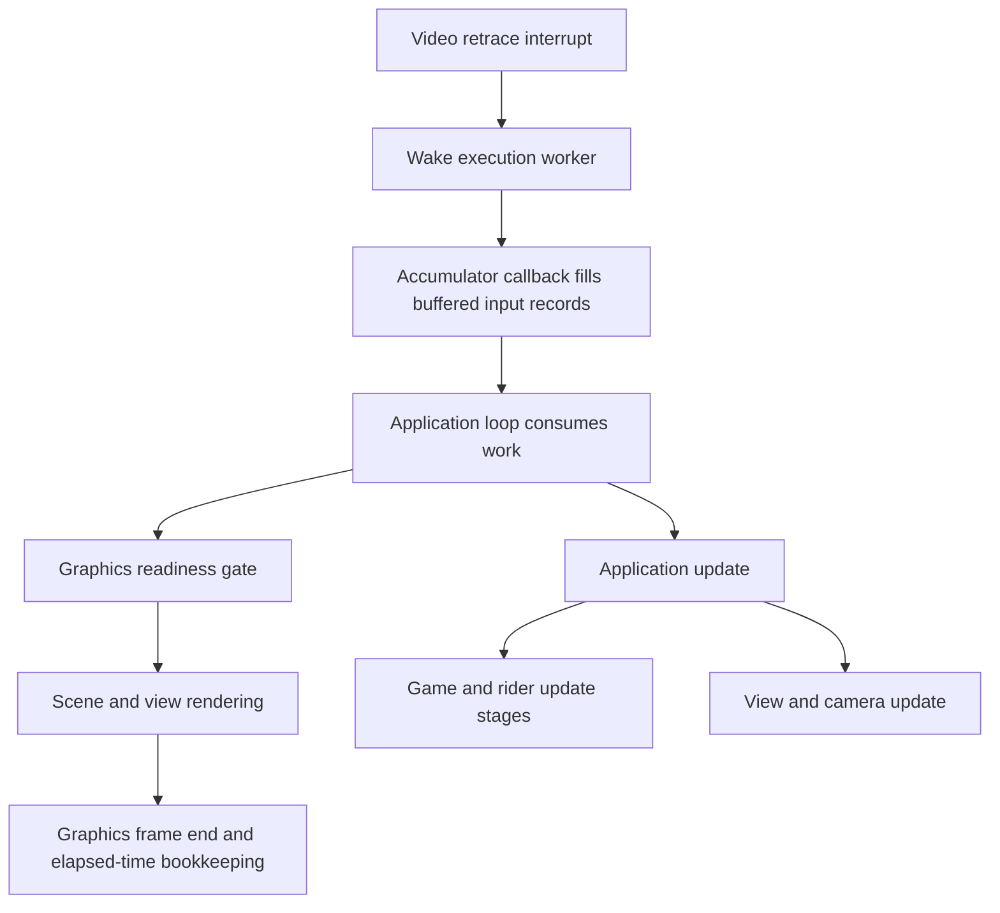

# Native rendering investigation — September 13, 2026

**Latest:** the [native pose prototype](120hz-native-interpolation.md) adds
model-instance transform history and an optional, guarded iPhone trial. The
immediate-upload version is not fast enough to recommend as the default.

**Continue with a targeted native render-state investigation.** The executable
has distinct application update and render callbacks, and observed rendering
leaves several important gameplay fields unchanged. However, repeated calls
usually hit a graphics-readiness gate, and rendering includes frame bookkeeping.
There is no working native 120 Hz mode yet. These experiments run on the Mac;
the installed iPhone build is unchanged.

**Follow-up:** the [render-seam experiments](120hz-render-seam.md) now complete
120 verified extra draws while respecting the queue and skipping duplicate
timing helpers. A frozen normal/offset/restored camera test produces changed
scene pixels and byte-identical original/restored captures. This is a native
rendering proof, still without a high-refresh or latency claim.

This follows the Downloads [handoff](ssx3-120hz-handoff-2026-09-13.md), especially
its scheduling trace and “draw twice without an update” test. It revises the
earlier MetalFX-first recommendation in [the broader analysis](120hz-analysis.md)
to match the priority on accurate geometry and lower latency. Image
interpolation remains a fallback if retaining game state or drawing twice costs
too much.

## Verified scheduling and state boundaries

All addresses below are for GXBE69 DOL SHA256
`b92162d6c616be3ce46b4eb61d5ddbb49891bc387ea7ddb2fea5792842fa29ce`.
Labels describe observed roles, not recovered original function names. The full
GameCube symbol map at revision `ec889b87b0110e039a8831c6ba106dc8de6f7a35`
still names most of these routines anonymously. PS2 addresses are research
leads, not interchangeable hooks.



| Boundary | Address / field | Evidence and next question |
| --- | --- | --- |
| Main application loop | `0x801CD33C` | Calls update and render through separately gated virtual callbacks |
| Retrace wake / worker | `0x801CABAC` / `0x801CAB4C` | Installed callback wakes a queue; worker calls `0x801CD144` |
| Buffered callback producer / consumer | `0x8010EEA0` / `0x8010EECC` | Live manager vtable; four-channel records, 30-entry ring; not a physics-substep count |
| Application update | `0x8010550C` | Live application vtable offset 28; advances watched position, camera and RNG |
| Application render | `0x8010A4C8` | Live application vtable offset 32; graphics readiness check followed by scene work and bookkeeping |
| Game update | `0x8001FB58` | Live target through `application+12`, vtable at object+36, slot+16; many staged rider calls |
| View update | `0x8006AF2C` | Live view vtable slot+16; calls a controller and substantial view reconstruction at `0x80069B04` |
| View matrix input | view+64 | Passed to graphics virtual slot+140 from `0x8010A6A4`; matrix convention and complete visibility coverage remain to be recovered |
| Render readiness | `0x8021A510` → `0x801CBB0C` | Returns false when a global pending-work count equals two, checked with interrupts disabled |
| Render elapsed work | application+168 | Incremented by update; render computes count/60.0, calls `0x8015C5A0`, processes `0x80139F20`, then clears the count |

The graphics vtable is statically initialized to `0x802F7C30`. Its readiness,
frame-end and view-matrix slots resolve to `0x8021A510`, `0x8021A5FC` and
`0x80224CC8`. The readiness count at `r13-20556` is incremented by a submission
path and decremented by a completion path. Its exact ownership protocol needs
recovery before bypassing the gate. Merely forcing the boolean true would not
create a valid additional graphics buffer.

The render-end helpers are not established as harmless caches, nor confidently
identified as audio functions. A second render supplies zero accumulated update
time, but still invokes both helpers when it reaches that path. They must be
separated or proven safe to repeat. Likewise, changing a scheduler rate does
not normalize camera smoothing, collision steps, trick windows or animation.

## Initial experiments

The probes wrap native dispatch in a separate player linked against the existing
public runtime libraries. No original game instructions, production runtime
sources, assets or phone installation are changed. Each run uses a separate
save profile and the same Garibaldi 027 course-start sequence.

1. **Control:** a 200-second run observes entry and return of update/render.
   After host second 140, 3,658 updates and 3,659 renders were recorded with a
   stable nonzero rider pointer. Position changed in 3,654 updates; the watched
   RNG arrays and view block changed in all updates. No render changed the
   watched position, rider state, view block or RNG arrays. Rendering did change
   other bytes near the rider and cleared application+168.
2. **Immediate repeat:** another 200-second run attempts 120 second render
   calls while riding, with no intervening top-level application update. The
   watched fields remain unchanged, but most calls take only microseconds.
   This alone is insufficient evidence of repeatable scene drawing.
3. **Gate audit:** another 200-second run records the graphics readiness return
   and end-of-frame helper calls. Of 120 repeats, **119 return false at the
   readiness gate**. One passes and reaches both end-of-frame helpers. All
   3,613 ordinary renders in the same post-140-second window pass the gate and
   reach those helpers. No observed repeat pair contains an intervening
   application update. The watched fields remain unchanged.
4. **Reusable probe validation:** a final 200-second run uses observable
   cross-chunk view-matrix and graphics frame-end counters. All 3,648 ordinary
   post-140-second renders reach both markers. Again, one of 120 repeats reaches
   both markers and the end-of-frame helpers; 119 fail readiness. None changes
   the watched gameplay fields. This supports one additional traversal of the
   scene-rendering path, not steady high-refresh presentation or visual fidelity
   of a new camera view.

All four runs completed with zero reported invalid memory accesses, GPU command
errors or JIT fallback runs. Interpreter fallback remains part of the existing
runtime. This is a scoped diagnostic result, not proof of deterministic gameplay
or of visually correct 120 Hz output.

An instrumentation lesson matters here: same-chunk game calls compile to direct
gotos in the generated native code. Dispatcher hooks at the inner scene helper
addresses consequently counted zero even during ordinary drawing. Those zeros
cannot establish missing rendering. The reusable probe instead counts the
cross-chunk graphics view-matrix and frame-end calls, qualified by their return
addresses. Game-generated source inspected to establish this stays local.

Snapshot coverage is deliberately explicit:

- Rider position: 12 bytes at rider+240; rider state through rider+0x718/+0xD30.
- First 0x100 bytes of the active view and first 0x400 bytes of application.
- Both six-word random arrays at `0x8035DE2C` and `0x8035DE44`.
- A 0x800-byte RAM window beginning at the rider. Allocation ownership of the
  entire window is unproven; changed tail words cannot yet be called rider
  cache mutations.

Comparisons see net entry-to-return changes. They do not count transient writes,
all RNG calls, particle/trail updates, audio events, streaming requests or other
threads' state. Guest time and interrupts continue during repeated rendering.
The input sequence is scheduled in host time and the independent runs follow
different trajectories; they are not a deterministic paired replay. Callback
duration includes child work, waits and host scheduling, so it is not a clean
CPU-cost benchmark. The Mac's 60 Hz display cannot validate mobile 120 Hz.

## Prioritized next experiments

1. **Recover the graphics frame protocol and extract a repeatable scene pass.**
   Target the readiness/submission/completion boundary and move elapsed-time
   bookkeeping outside repeated drawing. First prove two complete draws from
   unchanged state, including particles, trails, animation, audio and streaming
   counters. Do not bypass the queue limit or speed up the guest timebase.
2. **Prove a separate render view.** Recover camera transform conventions,
   snapshot rider/board/bone transforms and render a controlled second camera
   view. Recompute visibility for it. Validate camera cuts, rail attachments,
   crashes and streaming boundaries before interpolating between snapshots.
   This is targeted function recovery, not a prerequisite to decompile the
   whole game.
3. **Establish repeatable, guest-timed gameplay tests and measure phone cost.**
   Capture input edges against game time from a fixed state; measure distance,
   airtime, trick events and reset behavior. Separately measure two renders,
   actual display timestamps and input-to-display latency on the phone at
   bounded internal resolution. Preserve a native-rate fallback.
4. **Investigate true higher-rate updates only after timestep consumers are
   mapped.** Follow the newly resolved game/view update callbacks. Verify a
   time-normalized lower-rate test before increasing cadence. Camera smoothing,
   discrete events and collision rules require more than halving constants.

Interpolating two completed game states adds history delay; rendering geometry
does not by itself remove that latency. Late camera/input sampling or prediction
may reduce it, but introduces separate correctness questions at impacts and
cuts. The first native prototype should expose its sampling time explicitly and
compare latency against the unchanged game.

The intended architecture shares game-state capture, interpolation, cuts and
correctness checks across levels and mobile platforms. Metal and Vulkan handle
their own GPU resources and presentation. These hooks depend on executable
revision, not Garibaldi coordinates or asset names; another course still needs
validation, but should reuse the same mechanisms. Android remains subject to
the native app/runtime work described in the broader analysis.

## Reproduction and evidence boundary

```sh
python3 tools/gamecube_native_trace.py build \
  --game local/game/gc-gari-027 \
  --output local/research/120hz/new-native-player
# Run the isolated player with a scratch profile and a new absolute trace path:
# SSX_NATIVE_PROBE=/absolute/path/to/local/new-events.jsonl
# SSX_NATIVE_DOUBLE_RENDER=1 explicitly enables the bounded repeat experiment.
python3 tools/gamecube_native_trace.py summarize \
  local/research/120hz/native-path/double-v2-events.jsonl
```

The builder verifies the executable hash, snapshots its authored diagnostic
header, checks source injection points and records binary/source hashes while
verifying the production player is unchanged. It uses the existing native build;
it does not bypass that player's executable or module validation. The trace
file must be new, or the diagnostic aborts rather than silently losing evidence.
Summarization tests prevent early returns and legacy traces from being reported
as successful repeated rendering.

Raw evidence: ignored `local/research/120hz/native-path/` contains control,
double, double-v2 and final JSONL traces, per-run course observations, build receipts
and isolated binaries. Native receipts/logs are `20260913-072841`,
`20260913-073230`, `20260913-073824` and `20260913-074330` under
`local/reports/native-runs/`. Final trace SHA256 is
`b64e68e6db1da0bde9be2ca7538022787f72a9f4fea6aba2574507893a2ab9bf`;
its diagnostic header SHA256 is
`2372bcb37f738329af4ef7fadc8b1233ea4c396d4b1f106d69bb48363571e781`.
The isolated player builds and 21 focused Python tests passed. Production
runner hash remained unchanged through the diagnostic builds.
Downloaded symbols, disassembly, generated game code, assets and saves are not
committed. Only authored instrumentation, synthetic tests and these findings
belong in the private repository.
